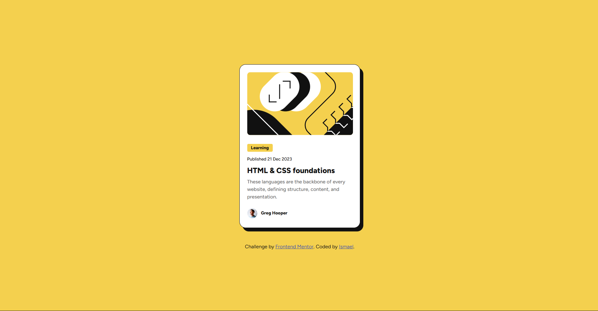
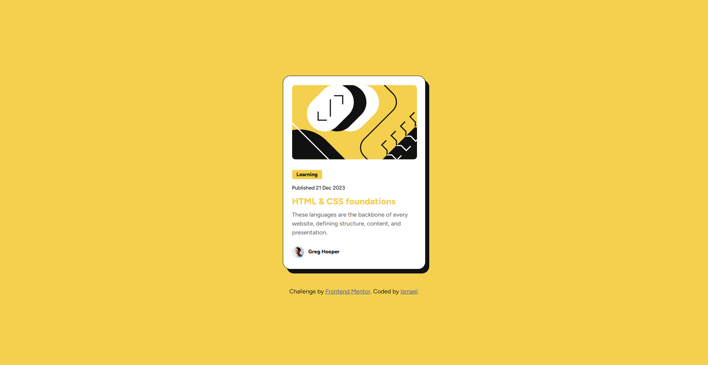

## Table of contents

- [Overview](#overview)
  - [Screenshot](#screenshot)
  - [Links](#links)
- [My process](#my-process)
  - [Built with](#built-with)
  - [What I learned](#what-i-learned)
  - [Continued development](#continued-development)
  - [AI Collaboration](#ai-collaboration)
- [Author](#author)

## Overview

### Screenshot





### Links

- Solution URL: [GitHub repository](https://github.com/ismael-dev1/Blog-preview-card)
- Live Site URL: [Blog preview card](https://ismael-dev1.github.io/Blog-preview-card/)

## My process

### Built with

- Semantic HTML5 markup
- CSS custom properties
- Flexbox
- Box shadow
- Line height

### What I learned
Some new things I didn't know yet to accomplish this challenge were:
- Box shadow 
- Line height

Firstly I tried to do the shaddow effect using: ```border-top-right-radius: ; and border-bottom-left-radius: ;```
```with border-right: ; border-bottom: ;```

But it didn't work, the I remembered of a property a teacher used once in a class I was watching to apply a shadow effect in a pseudo-class he was explaining to us.

I didn't know how to use the box-shadow but I asked AI (DeepSeek) and with simple explanations, (its syntax to specific) I was able to aplly the refered shadow effext

That was a great learning for me in this challenge.

Another learning was about the line height property, that is resposable for the y-axis text spacement in a paragraph.

### Continued development

My goal is to become able to make modern design, fast loading and 100% responsible pages.

### AI Collaboration

- What tools did you use?
  DeepSeek.

- How did you use them?
   Asked it to tell me what's box-shadow and line height, its syntaxes and how to use it.

- What worked well? What didn't?
  Everthing worked well.

## Author

- Frontend Mentor - [@ismael-dev1](https://www.frontendmentor.io/profile/ismael-dev1)

- GitHub - [ismael-dev1](https://github.com/ismael-dev1)
